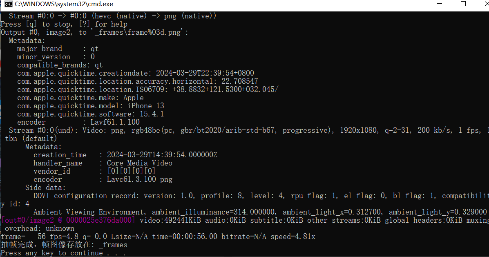
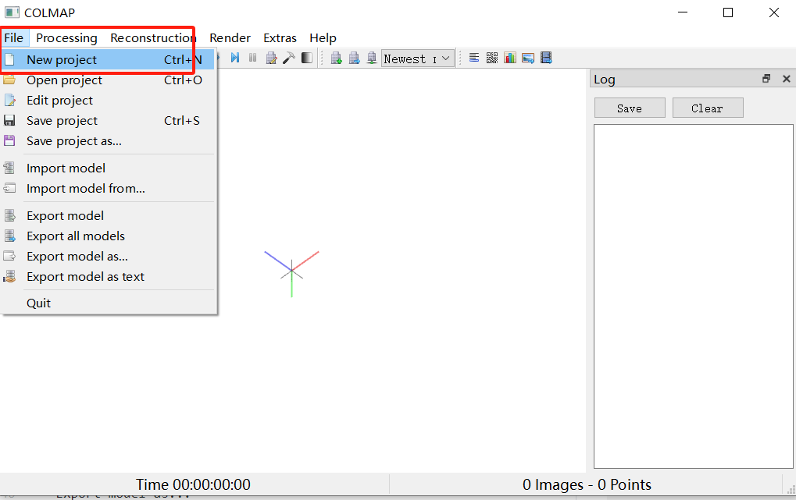
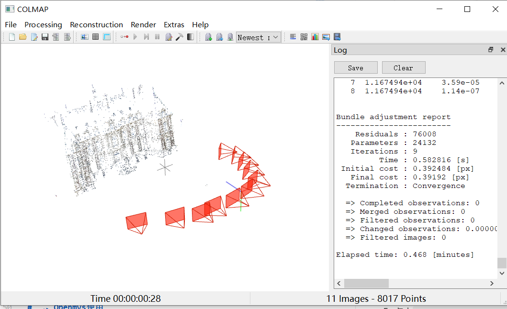
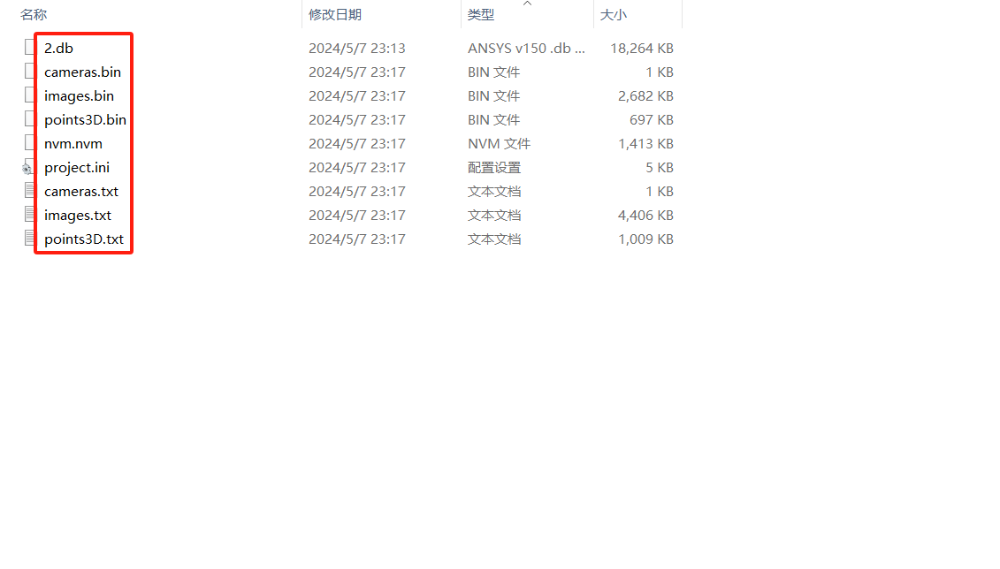
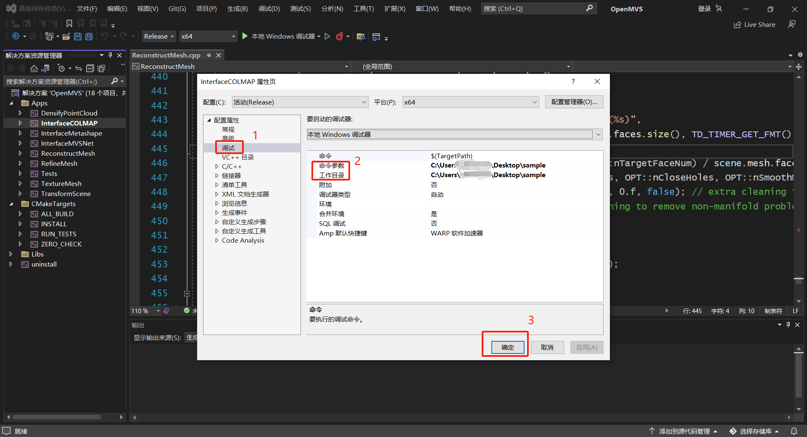
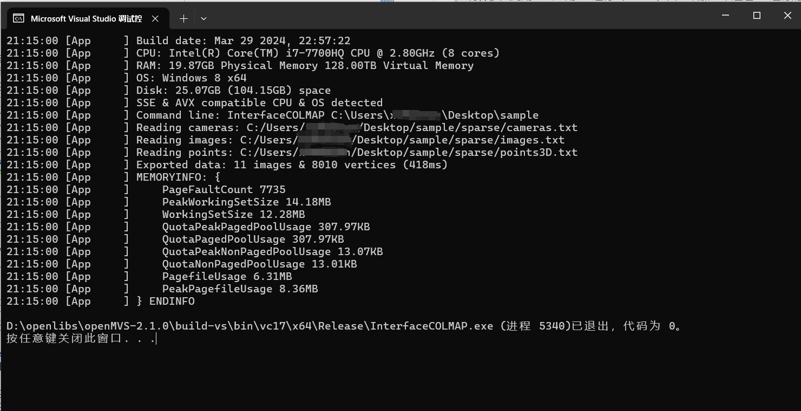
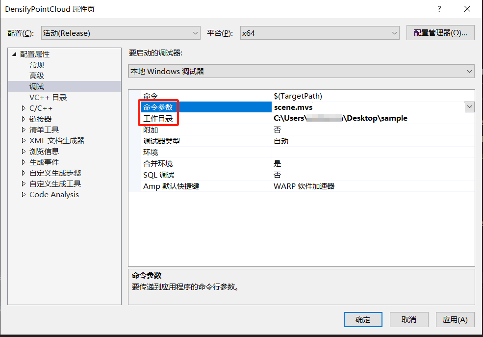
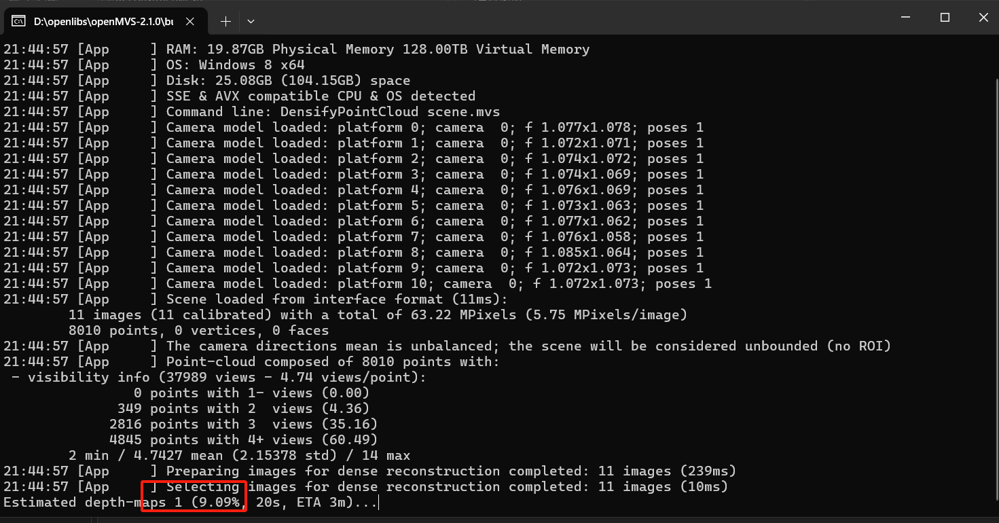
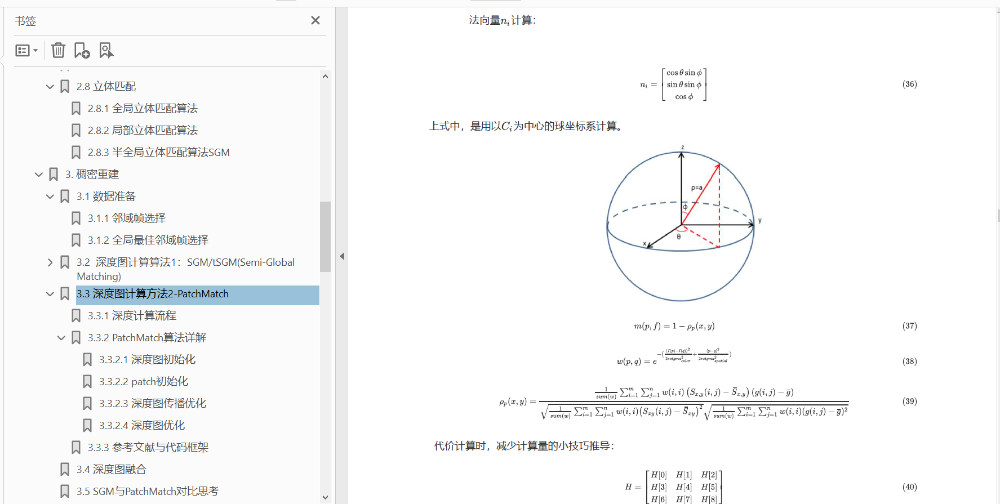
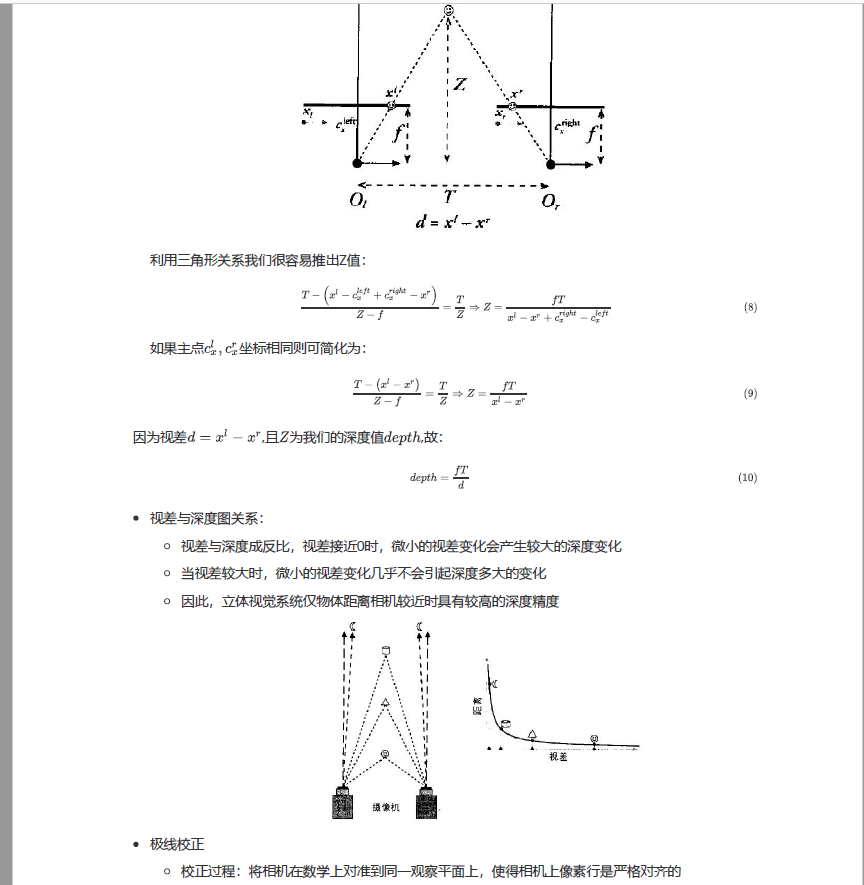

> 注意⚠**本文档的所有权和解释权归咸鱼用户`jay-eason`所有，[点击查看](https://m.tb.cn/h.g1H5nEk?tk=7skWWtFAaI4)咸鱼宝贝**  
# 一、Colmap稀疏重建
## 安装Colmap
1. 下载`Colmap`，如果不需要使用稠密重建无需下载带`CUDA`版本的（稍大），这里给一个国内下载链接：
链接：https://pan.baidu.com/s/1KUbKhDCvjo0ws2DkFON3pQ?pwd=ddnp 
提取码：ddnp
2. 解压后文件夹应是这样的：

双击`COLMAP.bat`打开命令行，稍等片刻即可见到`colmap`图形界面：

## 准备你的数据
1. 通过视频抽帧获取图片(可选)：
- 打开视频抽帧脚本，输入每秒要抽帧数量，这里输入2（一般视频每秒有`24/30/60`帧），**抽帧脚本可以咸鱼下单或者在qq上找作者要**。
- 将视频拖入视频抽帧脚本（视频目录不要包含中文和空格）


- 生成的照片储存在脚本目录的`_frames`，新的视频抽帧生成的文件夹会覆盖之前的文件！

2. 通过拍照或者视频抽帧获取的图片要尽量清晰，尤其注意要避免**运动模糊**，模糊的照片会对稀疏重建算法造成较大影响，尽可能挨个检查一下，删除质量较差的照片。
## 使用Colmap获取相机位姿
### 使用Colmap生成OpenMVS需要的文件
1. 新建文件夹，目录结构：
toy/
&emsp;images/
&emsp;&emsp;&emsp;toy1.jpg;
&emsp;&emsp;&emsp;toy2.jpg;
&emsp;&emsp;&emsp;....
&emsp;sparse/
&emsp;&emsp;&emsp;toy.db
&emsp;&emsp;&emsp;xxx.txt
&emsp;&emsp;&emsp;...
&emsp;&emsp;&emsp;xxx.ini
&emsp;&emsp;&emsp;xxx.nvm
&emsp;&emsp;&emsp;...
这里的`toy`可以自己随意名命,在这里用其举例说明
> 注意一定要将储存colmap信息的文件夹名命名为`sparse`(此时是空文件夹)，储存照片的文件夹命名为`images`(将之前获得的照片放入该文件夹内)
2. 打开`Colmap`图形界面，`File->New project`**(如果目录包含中文则会创建不成功)**

3. 创建新项目，储存在创建的`sparse`文件夹下，`Select`选择`images`文件夹
   
4. 点击`Processing->Feature extraction`相机模式设置为`PINHOLE`，其他参数默认。点击`Extract`进行提取，完成后点击关闭。

5. 点击`Processing->Feature matching`参数默认，直接点击`run`，完成后点击关闭。
6. 点击`Resconstruction->start reconstruction`，等待重建完成。

7. 稀疏重建后导出到`sparse`文件夹内：

```
Export model
Export model as...
Export model as text
```
保存后的`sparse`文件夹应当包含以下文件

至此`colmap`任务完成，保存关闭即可(覆盖ini文件)。
***
# 二、OpenMVS使用
## 命令行使用
1. 将toy文件夹拖动到`InterfaceCOLMAP.exe`上打开（简单快捷），或者使用命令
```
InterfaceCOLMAP.exe -w ...你的路径/toy
```
其他使用方法可以查看官网，或者双击`InterfaceCOLMAP.exe`查看命令含义（在文件夹下生成的.log文件内查看）
```
Generic options:
  -h [ --help ]                         produce this help message
  -w [ --working-folder ] arg           working directory (default current 
                                        directory)
  -c [ --config-file ] arg (=InterfaceCOLMAP.cfg)
                                        file name containing program options
...
```
程序运行完毕后会在`toy`文件夹下生成`scene.mvs`文件，可以使用`openmvsSamples`文件夹下的`Viewer.exe`查看（将`.mvs`文件拖动到`exe`文件上）

2. 将生成的`scene.mvs`拖动到`DensifyPointCloud.exe`生成稠密点云。
3. 完成后将生成的`scene_dense.mvs`拖动到`ReconstructMesh.exe`上重建网格。
4. 完成后将生成的`scene_dense_mesh.mvs`拖动到`RefineMesh.exe`上优化网格。
5. 完成后将生成的`scene_dense_mesh_refine.mvs`拖动到`TextureMesh.exe`上贴图。
6. 查看方式：
   - 将要查看的`mvs`文件拖动到`Viewer.exe`上打开即可查看，有的电脑可能缺乏一些动态库或者不兼容的问题无法使用`Viewer.exe`，可以使用第二种方式查看。
   - 生成的模型文件为`.ply`格式文件，可以使用`meshlab`查看。
  **注意⚡：`ply`格式是广泛使用的储存三维点云、网格、贴图的数据交换格式，`mvs`文件仅限`OpenMVS`使用**
## 通过Vsiual Studio运行

> 有许多人询问用如何通过`VS`运行`OpenMVS`，现新增通过`Viual Studio`运行案例的方法。
### 操作步骤
1. 首先确保你已完成或具备以下条件：
- 已经编译完成（如果你更改了代码需要重新编译，如果没有则不需要，因为在生成exe文件的时候已经编译过了）
- 你已经完成了`colmap`的重建，并将文件保存在了`sparse`中。
**注意⚡：对于使用官方案例重建（或者你已经有了一个`mvs`文件）的直接查看第3步**
2. 从`COLMAP`文件生成最初的`.mvs`文件：
- 右键点击`InterfaceCOLMAP`项目->`设置为启动项目`
- 右键`属性`->`调试`，`命令参数`和`工作目录`都设置为你的项目文件夹，在本文档案例中是`toy`文件夹，点击确定。

- `Ctrl+F5`运行项目，这时候如果成功会弹出命令行对话框

- `toy`目录文件夹下如果新生成了一个`scene.mvs`文件则说明已经运行成功

3. 生成稠密点云：
- 右键点击`DensifyPointCloud`项目->`设置为启动项目`
- 右键`属性`->`调试`，命令参数设置为`scene.mvs`，工作目录设置为你的项目文件夹，在本文档案例中是`toy`文件夹，**此后工作目录一直都是这个目录**。点击确定

- `Ctrl+F5`运行项目，如果弹出命令行出现进度数值，说明运行成功。

4. 优化网格：
- 使用`RefineMesh`项目，与之前流程相同（设置启动项、右键属性、`Ctrl+F5`运行），目录文件不变，但是命令参数为新生成的`mvs`文件。
5. 贴图：使用`TextureMesh`项目，流程与之前相同，略...


***
# OpenMVS解析文档
> **联系作者获取OpenMVS原理详解 + 逐行源码解析文档**




